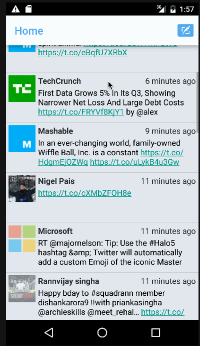

# Twitter Client
This Client provide ability to read data from your twitter home time line. Allows you to tweet and see the updated tweet immediately.

Submitted by: Akshay Kulkarni

Time spent: 15 hours spent in total

## User Stories

The following user stories are completed:

* [x] User can sign in to Twitter using OAuth login
* [x] User can view the tweets from their home timeline
        User should be displayed the username, name, and body for each tweet
        User should be displayed the relative timestamp for each tweet "8m", "7h"
        User can view more tweets as they scroll with infinite pagination
* [x] User can compose a new tweet
        User can click a “Compose” icon in the Action Bar on the top right
        User can then enter a new tweet and post this to twitter
        User is taken back to home timeline with new tweet visible in timeline

The following advanced user stories are optional:

* [ ] Advanced: While composing a tweet, user can see a character counter with characters remaining for tweet out of 140
* [x] Advanced: Links in tweets are clickable and will launch the web browser (see autolink)
* [ ] Advanced: User can refresh tweets timeline by pulling down to refresh (i.e pull-to-refresh)
* [ ] Advanced: User can open the twitter app offline and see last loaded tweets
* [ ] Tweets are persisted into sqlite and can be displayed from the local DB
* [ ] Advanced: User can tap a tweet to display a "detailed" view of that tweet
* [ ] Advanced: User can select "reply" from detail view to respond to a tweet
* [x] Advanced: Improve the user interface and theme the app to feel "twitter branded"
* [ ] Bonus: User can see embedded image media within the tweet detail view
* [ ] Bonus: Compose activity is replaced with a modal overlay

## Video Walkthrough 

Here's a walkthrough of implemented user stories:

GIF created with [LiceCap](http://www.cockos.com/licecap/).

## License

    Copyright [2015] [Akshay Kulkarni]

    Licensed under the Apache License, Version 2.0 (the "License");
    you may not use this file except in compliance with the License.
    You may obtain a copy of the License at

        http://www.apache.org/licenses/LICENSE-2.0

    Unless required by applicable law or agreed to in writing, software
    distributed under the License is distributed on an "AS IS" BASIS,
    WITHOUT WARRANTIES OR CONDITIONS OF ANY KIND, either express or implied.
    See the License for the specific language governing permissions and
    limitations under the License.
